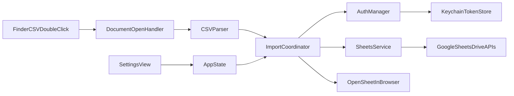

# Architecture - CSV to Sheets for macOS

## Design Goals

- Keep the app local-first and CSV-first.
- Keep module boundaries obvious for OSS contributors.
- Avoid backend dependencies and keep all logic on-device except Google API calls.

## High-level Flow

## Module Boundaries

### `AppState`

Single source of truth for app-level state:

- auth status and account identity
- current import state and progress
- user settings flags (auto-open browser, delimiter override)

### `AuthManager`

Owns Google OAuth desktop flow and token lifecycle:

- starts OAuth sign-in flow
- restores token on launch from Keychain
- refreshes expired access token
- signs user out and clears credentials

### `DocumentOpenHandler`

Bridges macOS file-open events into import requests:

- handles `.csv` opened from Finder/Open With
- validates file URL readability
- passes normalized input to `ImportCoordinator`

### `CSVParser`

Parses local CSV safely and predictably:

- supports UTF-8
- supports quoted fields and embedded delimiters
- detects malformed rows and returns structured errors
- preserves original row/column order

### `SheetsService`

Thin Google API adapter (no business logic):

- create spreadsheet
- append values in batches
- return sheet URL + identifier

### `ImportCoordinator`

Orchestrates end-to-end import flow:

1. validates input file
2. obtains valid auth token
3. parses CSV
4. creates spreadsheet
5. uploads rows in batches with retry policy
6. reports progress and final result
7. opens browser URL when enabled

### `SettingsStore`

Persist non-sensitive settings:

- browser auto-open toggle
- delimiter override
- default CSV opener preference state (where applicable)

Credentials are not stored here; they remain in Keychain only.

## Data Contracts (Minimal)

- `ImportRequest`: source URL, optional delimiter override, optional custom title
- `ImportResult`: spreadsheet ID, spreadsheet URL, rows uploaded, duration
- `AppError`: typed errors (`auth`, `parsing`, `network`, `rateLimit`, `unknown`) with user-facing message

## Error Strategy

- Use typed errors at service boundaries.
- Map typed errors to concise, actionable UI messages.
- Support retry for transient network/rate-limit failures.
- Do not hide partial failures; report uploaded row count when known.

## Performance Notes

- Parse and upload off the main thread.
- Batch appends to reduce API calls and stay under request limits.
- Emit progress updates for large files.
- Keep memory bounded; avoid loading very large files into one giant in-memory structure when possible.

## Security & Privacy Notes

- OAuth tokens stored in Keychain only.
- No proprietary backend.
- File contents sent only to Google APIs during import.
- No analytics by default.
